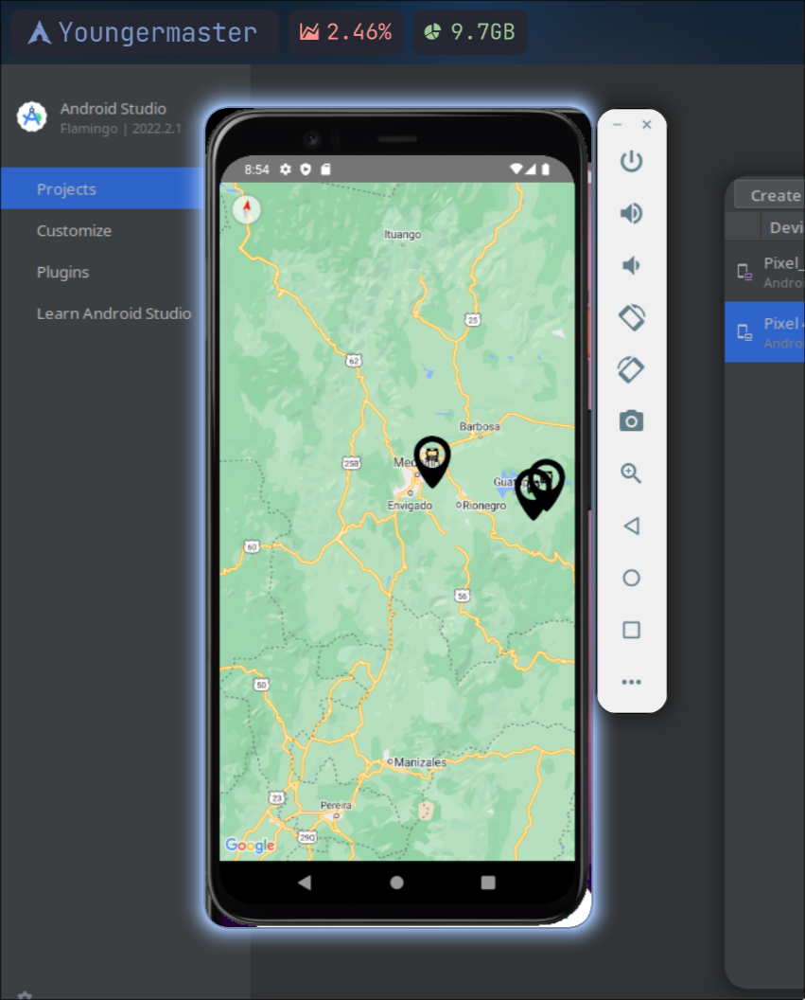
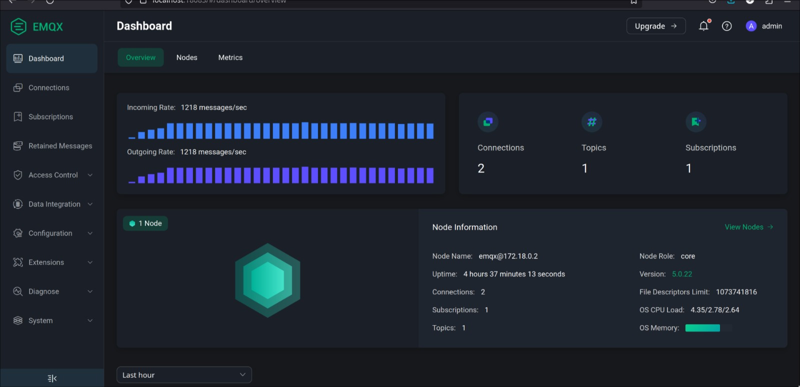
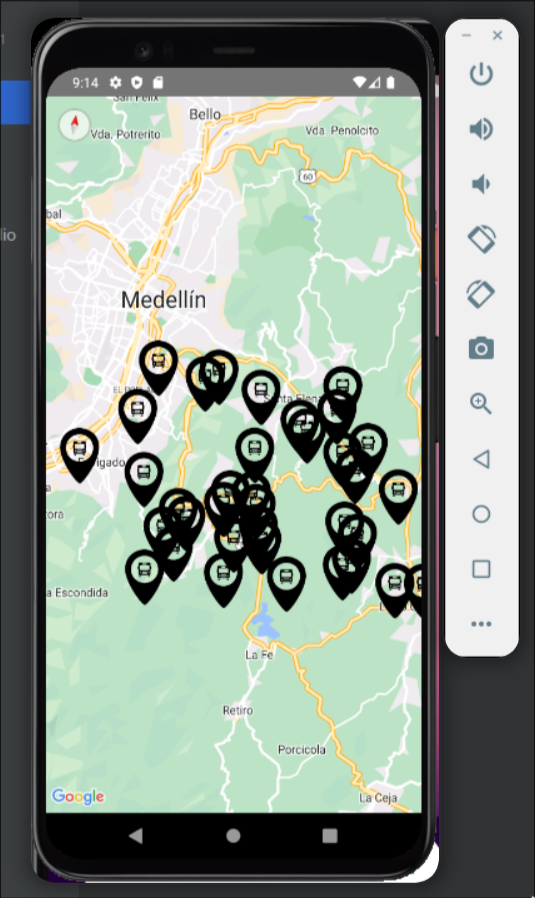

# Flutter React Native MQTT

A project to store some client side apps to intereact with MQTT Brokers and Kafka.

## RabbitMQ

There is Flutter Stuff and a Docker compose file.

## EMQX

There is React Native Stuff, Python scripts to simulate users and a Docker compose file. These are some screenshots:

With some users/markers

Now we run several users (more than 1.000 Requests per second):

And we update again to checkout the performance:

